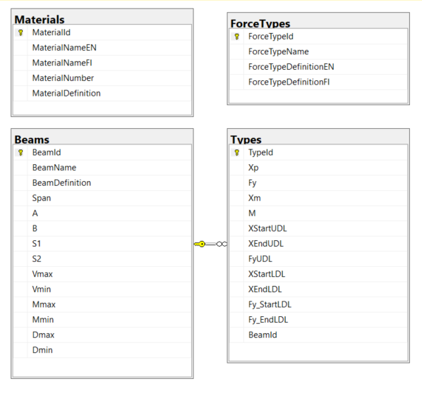
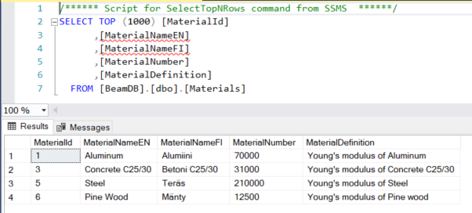
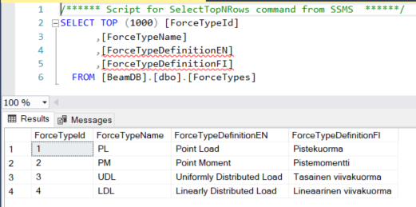

# Beam Calculator App

## Backend

Target framework: net5.0
Projektin template: ASP.NET Core Web API (REST API sovellus)
Kehitysympäristö : Visual Studio 2019 Community

Backendin pääasiallinen tarkoitus tässä projektissa on olla linkkinä frontendin (React) ja SQL Server tietokannan välillä.

**Koodauksen kulku**
Luotiin ensin luokat Beam, Type ja ForceType, joissa löytyy tietokantojen kentät ja kytkennät.
BeamDbContext konstruktorin luonti (DbContext ja DbSet taulujen luonti).

Tietokannan kytkentä (ConnectionStrings) lisätään appsettings.json tiedostoon,
jota kutsutaan Startup.cs tiedoston ConfigureServices metodissa/funktiossa.

Tietokantataulujen luonti SQLServerille automaattisesti migraation avulla. Tarkista ensin koodi ajamalla `build`. Kirjoita Package Manager Console:ssa `Add-Migration "InitialCreate"`-käskyllä ja päivitä tietokanta `Update-Database`-käskyllä.

Controllerien luonti Scaffold:n (API Controller with actions, using Entity Framework) avulla.
Tällä tavalla saat GET/POST/PUT/DELETE-"perushaut" luotua automaattisesti. Manuaalisesti muutin BeamControllerin GetBeams-metodia, jotta saan samalla haulla kaiken tiedon Beam:sta, myös Beamiin kuuluvat Typet.

Käynnistäessä ohjelman Swagger pitäisi käynnistyä, jolla voit tehdä pyyntöjä juuri luotuun tietokaan.

### Error

**Alkutilanne:**
Beam-luokassa `public List<Type> Types { get; set; }`
Type-luokassa `public Beam Beam { get; set; }`

**Virhe**
Code Details
500 Error: Internal Server Error

Response body
System.Text.Json.JsonException: A possible object cycle was detected. This can either be due to a cycle or if the object depth is larger than the maximum allowed depth of 32. Consider using ReferenceHandler.Preserve on JsonSerializerOptions to support cycles.

**Korjaus**
Beam-tauluun listautuu Type:t ja Type-tauluun listautuu Beam. Tämä aiheuttaa syklin.
Virhe voidaan korjata lisäämällä `[JsonIgnore]`-tagi `public Beam Beam { get; set; }` yläpuolelle Type-luokkaan, jolloin Beam jätetään aina huomioimatta.
Toinen vaihtoehto korjata tämän tyyppinen virhe on luoda apuluokka (DTO), joka palautetaan.

## Tietokanta

Tietokanta luotiin paikalliseen (local) SQL Serveriin
Helpoin tapa sitä on katsella ja muokata Microsoft SQL Server Management Studio:lla.

Tietokanta koostuu neljästä taulusta.

Erillisestä Materials-taulusta, josta saadaan lyhenteet ja arvot eri materiaaleille, joita laskennan alkuarvojen syötössä tarvitaan.

Erillisestä ForceTypes-taulusta, josta saadaan lyhenteet eri kuormatyypeille, joita laskennan alkuarvojen syötössä tarvitaan.

Beams- ja Types-taulut on (one to many kytköksellä) yhdistetty. Eli yhdellä palkilla (Beam) voi olla monta tyyppiä (Type).
Beams-taulu sisältää palkin dimensiot (pituus ja tuet) ja laskennan tuloksena saadut leikkausvoima- ja taivutusmomentien maksimiarvot.
Types-tauluun tulostuu syötetyt kuormitukset.

Copyright © Timo Kivelä 2023
