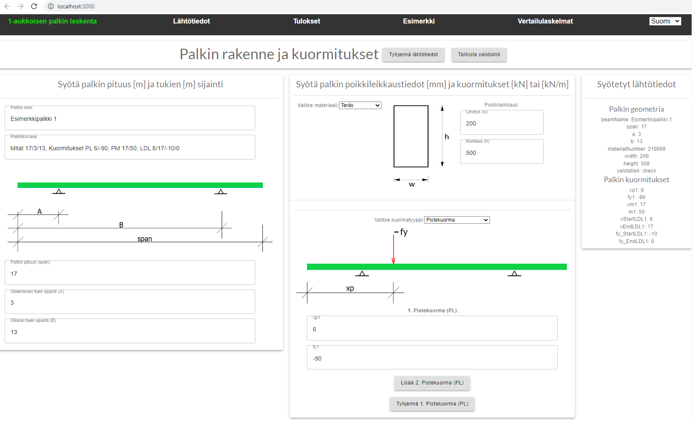
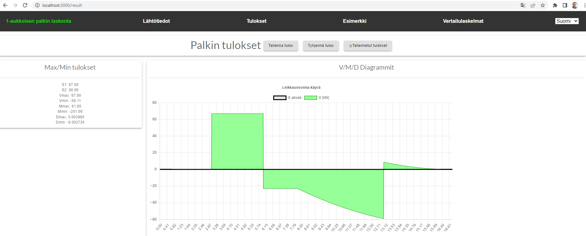
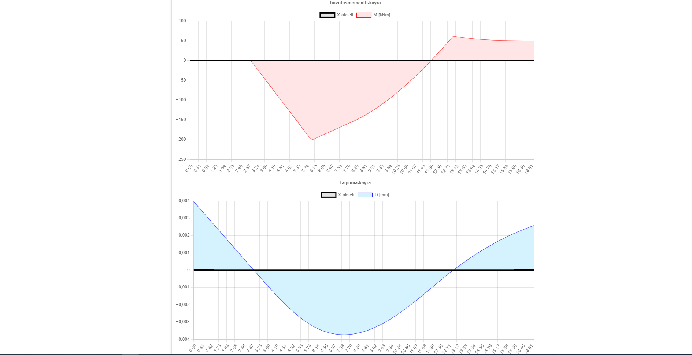
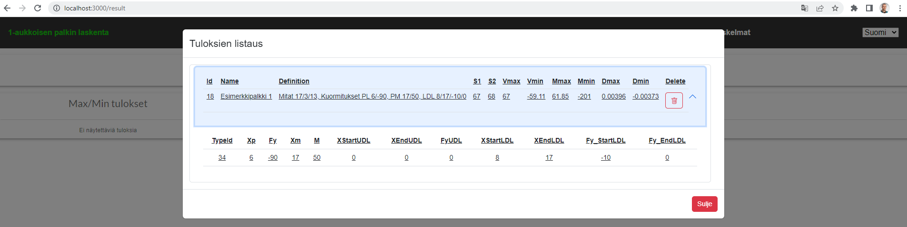

# Beam Calculator App

## Frontkoodin runko

Koodin runko näkyy `app-structure.txt` tiedostossa.

Lähtötietojen syöttö ja tulokset eriytetty eri sivustolle.
index.tsx sisältää vain App.tsx tiedoston. App.tsx:ssä luodaan navigointi eri sivuille (Beam (lähtötiedot), Result (tulokset) ja Example ja Comparison Results sivut).
Lähtötiedot sivu on eriytetty neljään toimintalohkoon: napit, palkin pituuden ja tukien syöttö, poikkileikkauksen ja kuormitusten syöttö ja syötetyt lähtötiedot.
Tulokset sivussa on napit, maksimitulokset, viivadiagrammi-lohkot.

### Kuvia Layout:sta ja laskennan kulku

Syötä palkin pituus ja tukien sijainnit.
Kuormien syötössä valitse ensin kuormatyyppi (forceType) alasvetovalikosta ja anna kuormituksen arvot. Syötetyt arvot näkyvät oikeassa laidassa.
Ylalaidan napit:

- Tyhjennä lähtötiedot (Tyhjentää kaikki lähtötietokentät.)
- Tarkista validointi (Tarkistaa syöttökentät palkin pituuksien, tukien ja poikkileikkauksen syötön osalta. Syöttökentän alalaitaan ilmestyy virheilmoitus, jos kenttään syötetty vääränmuotoinen arvo.)

Kun olet syöttänyt kaikki lähtötiedot, mene Tulokset-välilehdelle.

Paina Laske tulos-nappia. Saat tulokseksi Taivutusmomentti-, Leikkausvoima- ja Taipumakäyrät (viivadiagrammi) ja niiden maksimiarvot.

Jos haluat tallentaa nämä tietokantaan paina Tallenna tulos-nappia.
Tallennetut tulokset saat näkyviin painamalla Tulokset-välilehden Tallennetut Tulokset-nappia. Tallennetut tulokset näkyvät popup-sivuna.

## Ohjelmassa käytettyjä elementtejä

- React
- typescript ( tyyppijärjestelmä)
- Hooks: useState, useEffect (tila ja toiminnon laukaisu)
- react-chartjs-2 (diagrammien luonti)
- material-ui
- react-bootstrap
- redux (tilan hallinta ja keskittäminen)
- react-i18next (sivujen käännökset: Suomi/English )
- axios (http pyynnöt tietokantaan)

## Vinkkejä

`rfc` luodaan uusi functionaalinen komponenttipohja.

## Laskentaesimerkit

Vertailulaskelmat muilla laskenohjelmilla löytyvät Example- ja Comparison Results-sivuilta.

## Lisättäviä asioita

- Syötteiden päivitys (tallennetun laskennan muuttaminen)
- PDF-tulostus laskennasta (react-pdf)

Copyright © Timo Kivelä 2023
